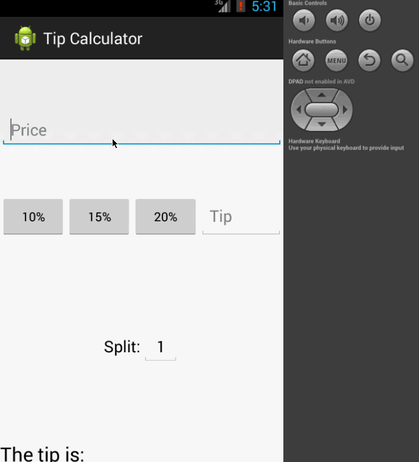

# Tip Calculator

This app calculates the tip on a given price.

Time Spent: <2 hours

Completed user stories:

   * [X] Required: User is displayed the tip of specified percentage for specified entered amount
   * [X] Required: User enters the total amount of the transaction
   * [X] Required: User can select between tip amounts (i.e 10%, 15%, 20%)
   * [X] Required: Upon selecting tip amount, formatted tip value is displayed
   * [X] Optional: User changes the total amount and updated tip is reflected automatically
   * [X] Optional: User can select custom tip percentage if desired
   * [X] Optional: User can select how many ways to split the tip

Notes: I my listener code is really ugly. How would you suggest I refactor it to make it cleaner?

Walkthrough:

